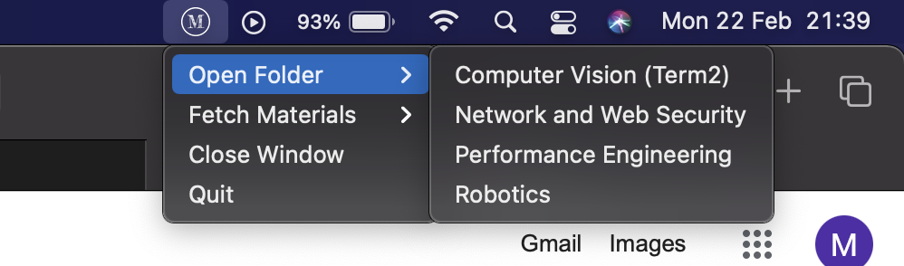
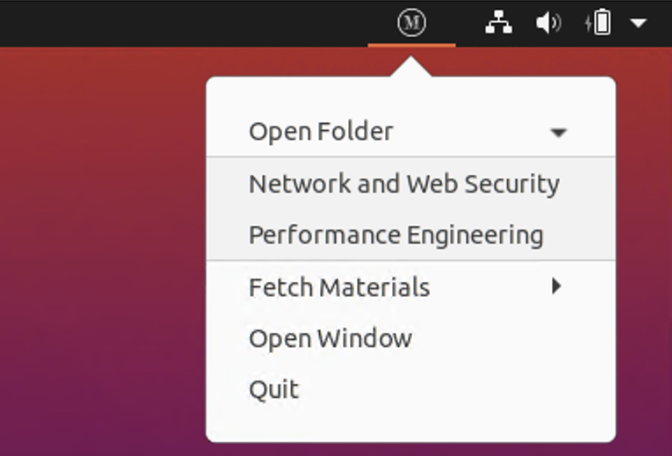
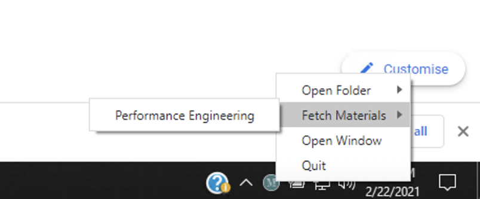

# Materials System Tray Application

## Overview

Imperial's Department of Computing Materials System Tray application

Pulls all the latest resources from your course into your folder, pulling only the ones you haven't got in your folder.

Credentials are stored using keytar:

> On macOS the passwords are managed by the Keychain, on Linux they are managed by the Secret Service API/libsecret, and on Windows they are managed by Credential Vault.

### Ubuntu Installation

`curl -LJO https://raw.githubusercontent.com/mayanksharma3/materials-app/master/scripts/ubuntu.sh && sudo sh ubuntu.sh`

### MacOS 

Check the latest release and download the `.dmg` file

### Windows

Check the latest release and download the `.exe` file

